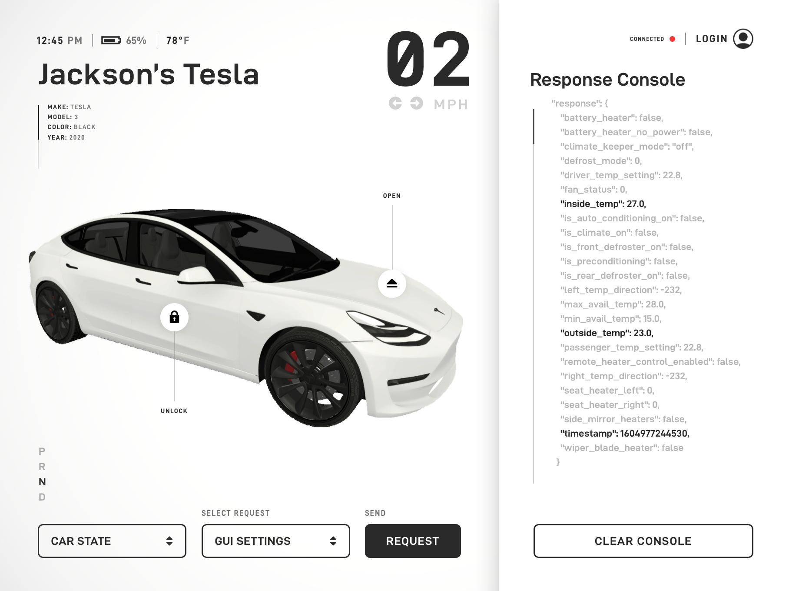

# Tesla API Unity/C# Wrapper



## Overview

The Tesla API Unity/C# Wrapper gives you the ability to easily use the Tesla API from your Unity applications. You can make state or command requests to your vehicle and add more endpoints for future supported features of each Tesla model. This project also contains immersive examples for creating XR applications to control your Tesla using new digital mediums.

## Features

- Tesla API Wrapper for Unity (OAuth2.0, List Vehicles, State / Command Requests, etc.)
- 3D Electric Vehicle Model
- Ability to Add Vehicle Endpoint Methods for Future Vehicle Software Updates.
- Real-time Tesla Debug Console UI Example
- Universal Render Pipeline Supported
- Task-based Asynchronous Pattern
- Supported Result Objects

## Versioning

This package uses the semantic versioning strategy as required for all Unity packages. More info at [https://docs.unity3d.com/Manual/upm-semver.html](https://docs.unity3d.com/Manual/upm-semver.html)

## Simple API Wrapper Usage

```csharp
using Tesla.API.Core;
using UnityEngine;

public class Example : MonoBehaviour {

    private async void Start() {

        TeslaClient Client = new TeslaClient();
        await Client.AuthenticateAsync("your@email.com", "••••••••••••");

        Client.User.GetVehicle<Model3>(async (M3) => {

            var state = await M3.GetDriveStateAsync();
            Debug.Log($"Vehicle Heading: {state.Response.heading}");

            var command = await M3.SetChargeLimitAsync(80);
            Debug.Log($"Charge Limit Set Result: {command.Response.result}");

        });
    }
}
```

## Adding Vehicle Endpoints

```csharp
using Tesla.API.Core;
using System.Threading.Tasks;

public static class VehicleExtensions
{
    public static async Task<Command> OpenChargePortAsync(this Vehicle vehicle) {

        return await vehicle.RequestAsync<Command>($"/api/1/vehicles/{vehicle.Id}/command/charge_port_door_open");
    }
}
```
