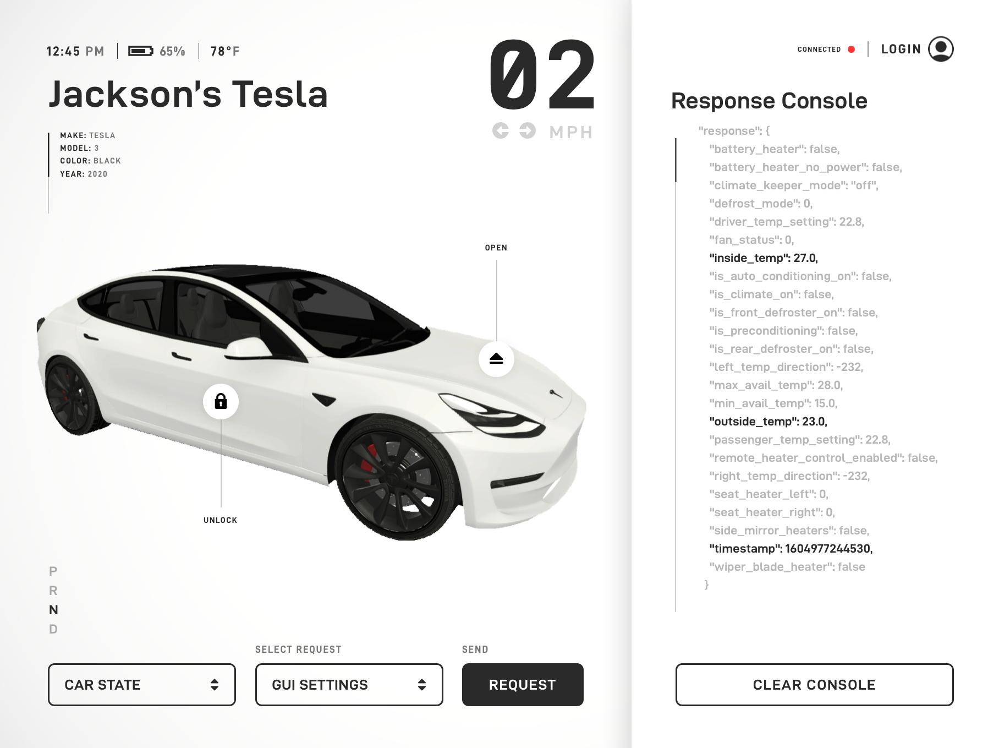

# Tesla API Unity/C# Wrapper



## Overview

TeslaKit Unity/C# Wrapper package gives you the ability to easily use the Tesla API from your Unity applications. You can make state or command requests to your vehicle and add more endpoints for future supported features of each Tesla model.

Massive thanks to https://github.com/timdorr for creating documentation around the Tesla API. Check out the Unoffical Tesla API https://tesla-api.timdorr.com/ for more documentation on the exact endpoints and auth services that are being used in this plugin.

## Features

- Tesla API Wrapper for Unity (OAuth2.0, List Vehicles, State / Command Requests, etc.)
- 3D Vehicle Model
- Ability to Add Vehicle Endpoint Methods for Future Vehicle Endpoint Updates.
- Real-time Tesla Debug Console UI Examples
- Universal Render Pipeline Supported
- Async/await

## Versioning

This package uses the semantic versioning strategy as required for all Unity packages. More info at [https://docs.unity3d.com/Manual/upm-semver.html](https://docs.unity3d.com/Manual/upm-semver.html)

## Simple API Wrapper Usage

```csharp
using Tesla.API.Core;
using UnityEngine;

public class Example : MonoBehaviour {

    private async void Start() {

        TeslaClient Client = new TeslaClient();
        await Client.AuthenticateAsync("your@email.com", "••••••••••••");

        Client.User.GetVehicle<Model3>(async (M3) => {

            var state = await M3.GetDriveStateAsync();
            Debug.Log($"Vehicle Heading: {state.Response.heading}");

            var command = await M3.SetChargeLimitAsync(80);
            Debug.Log($"Charge Limit Set Result: {command.Response.result}");

        });
    }
}
```

## Adding Vehicle Endpoints

### Example Extension Method for Vehicle Command Endpoints

```csharp
using Tesla.API.Core;
using System.Threading.Tasks;

public static class VehicleExtensions
{
    public static async Task<Command> OpenChargePortAsync(this Vehicle vehicle) {

        return await vehicle.RequestAsync<Command>($"/api/1/vehicles/{vehicle.Id}/command/charge_port_door_open");
    }
}
```

### Creating Serializable Types for a New Vehicle State Endpoints

If you create a endpoint extension method for a new type of vehicle state you will have to create a serializable type that matches exactly the structure of the incoming JSON from the API for the serializer to work. After you've created the seriablizable type pass it into the generic RequestAsync<T>() method as a type paramater.

## Installation

Follow the official Unity guide linked below to install this package using the package manager inside of Unity.
https://docs.unity3d.com/Manual/upm-ui-giturl.html

## Potential Improvements

- Add the rest of API endpoints
- Add refresh token method
- Add support for raw json response ex.Task<Response<T>> Response.Raw
- Handle sign in failed if possible either for incorrect password or don't have an account etc.
- Add better and more robust exception handing
- Implement an awaitable handle for all requests for users to create loading bars or loading wheels.
- Break up auth request method into smaller pieces
- Fix Wake command response object not parsing from newtonsoft
- Add Neuralink support 🤷‍♂️
